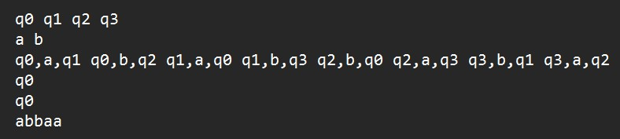
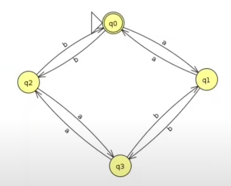

# Implementação de AFD

Neste trabalho, foi implementado um autômato finito determinístico (AFD) na linguagem Java.

## Estrutura da pasta

- `src`: essa pasta contém os códigos-fonte do AFD

## Exemplo de funcionamento ⚙️

Digamos que o autômato receba a seguinte entrada para a liguagem L = {w | w possui um número par de a e b}:

 

* A linha 1 representa todos os estados do autômato.
* A linha 2 representa todos os símbolos do alfabeto da linguagem.
* A linha 3 representa as transições de estado, por exemplo, em "q0,a,q1", "q0" é o estado de origem, "a" é o símbolo do alfabeto e "q1" é o estado de destino.
* A linha 4 representa o estado inicial.
* A linha 5 representa o(s) estados de aceitação.
* A linha 6 representa a cadeia de entrada que será aceita ou rejeitada pelo AFD.

Primeiramente, o programa verificará se a palavra é vazia. No caso dessa linguagem, o estado inicial também é estado de aceitação, então, a palavra vazia seria aceita.

Caso contrário, para cada símbolo da cadeia de entrada, em uma estrutura de dados chamada "HashMap", que é uma tabela que armazena pares de chave-valor, é realizado uma consulta com um valor de chave: "estado atual" + "símbolo que o AFD lê quando faz a transição de um estado para outro", que retorna o valor/estado de destino dessa chave.

Então, quando o último símbolo da cadeia de entrada for lido, se o estado atual for um estado de aceitação, a palavra é aceita, do contrário, é rejeitada.

Abaixo está a imagem do AFD de L = {w | w possui um número par de a e b}, vamos fazer um exemplo de processamento dessa cadeia "*abbaa*":

|  |
|:--:|
| *Imagem do canal do YouTube "Prof. José Rui", link do vídeo original:* [https://youtu.be/Ic1D1239DVw?si=WJePVaqxN5-oJrW5](https://youtu.be/Ic1D1239DVw?si=WJePVaqxN5-oJrW5) |

1) Verifica se a palavra é vazia, nesse caso, é falso

2)
  - Estado atual: q0
  - Símbolo: *a*
  - Estado de destino = (Estado atual + Símbolo) = q1

3) 
  - Estado atual: q1
  - Símbolo: *b*
  - Estado de destino = (Estado atual + Símbolo) = q3

4) 
  - Estado atual: q3
  - Símbolo: *b*
  - Estado de destino = (Estado atual + Símbolo) = q1

5)
  - Estado atual: q1
  - Símbolo: *a*
  - Estado de destino = (Estado atual + Símbolo) = q0

6) 
  - Estado atual: q0
  - Símbolo: *a*
  - Estado de destino = (Estado atual + Símbolo) = q1

7) Fim da leitura da cadeia

8) Estado atual "q1" não é um estado de aceitação, palavra é rejeitada

9) Impressão na tela do "rejeita"

Mais um exemplo, agora com a cadeia de entrada "*abab*":

1) Verifica se a palavra é vazia, nesse caso, é falso

2) 
  - Estado atual: q0
  - Símbolo: *a*
  - Estado de destino = (Estado atual + Símbolo) = q1

3)
  - Estado atual: q1
  - Símbolo: *b*
  - Estado de destino = (Estado atual + Símbolo) = q3

4) 
  - Estado atual: q3
  - Símbolo: *a*
  - Estado de destino = (Estado atual + Símbolo) = q2

5) 
  - Estado atual: q2
  - Símbolo: *b*
  - Estado de destino = (Estado atual + Símbolo) = q0

7) Fim da leitura da cadeia

8) Estado atual "q0" é um estado de aceitação, palavra é aceita

9) Impressão na tela do "aceita"

